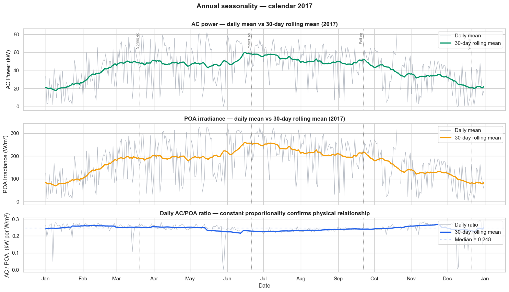
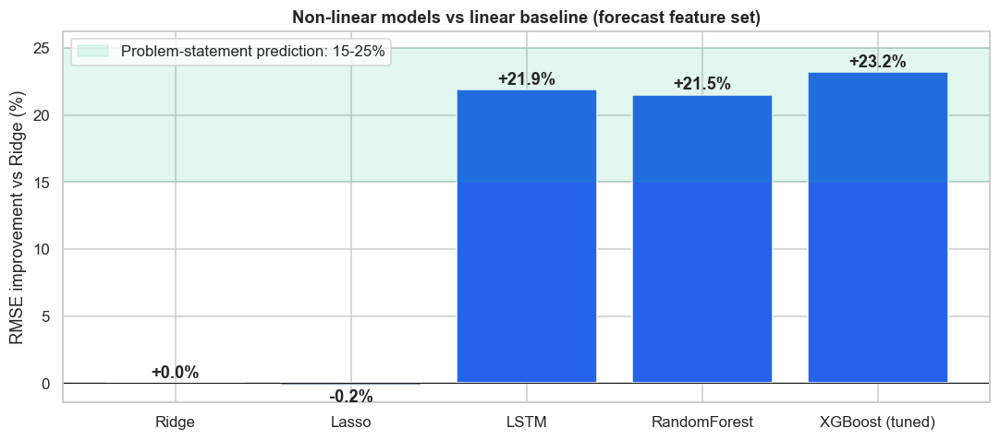
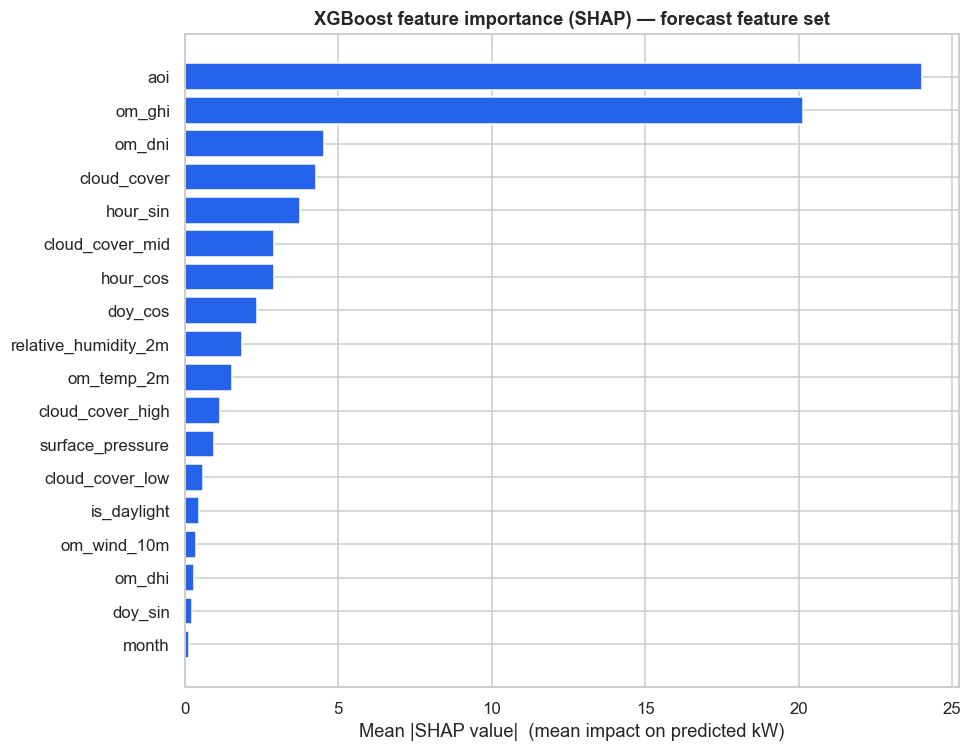
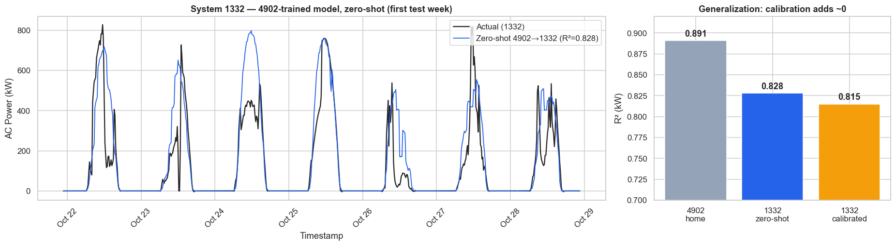
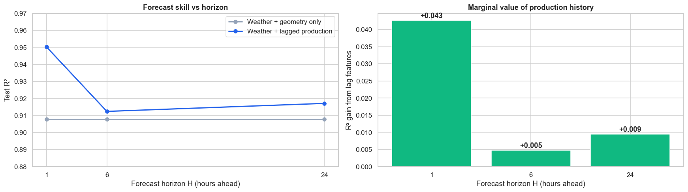

# Forecasting Solar Power — Capstone (Combined Submission)

**Shawn Cunningham — Layer 3 Development Inc.**
UC Berkeley AI/ML Professional Certificate · Capstone

> **In one sentence:** We built software that predicts how much electricity a
> solar array will produce — accurately (about **89%** of the variation explained
> using only weather and time of day, **98%** with the array's own sun sensor),
> it works on a brand-new site **without retraining**, and it points to a cheap
> way to make it even better.

**The complete analysis lives in one notebook:**
[`Solar_PV_Forecasting.ipynb`](Solar_PV_Forecasting.ipynb) —
a top-to-bottom walkthrough from raw data to a saved, deployable model. Every
term below is explained for a general audience; see [`GLOSSARY.md`](GLOSSARY.md)
for definitions.

**The original problem statement** is [`Original_Technical_Brief_FEB2026.pdf`](Original_Technical_Brief_FEB2026.pdf)
— a polished two-page brief (UC Berkeley format) written at the start of the
project: page 1 lays out the problem, planned approach, models, features,
evaluation, and data sources; page 2 is an illustrated glossary. It captures the
*plan*; the finished work confirmed most of it and refined a few things — see
[§8, "What changed since the original brief"](#8-what-changed-since-the-original-brief).

---

## 1. The problem (plain language)

Anyone running equipment off solar power — battery banks, EV chargers, computing
clusters — needs to know **how much power the panels will make in the next hour,
or tomorrow.** Get it right and you run the power-hungry jobs when the sun is
strong and ease off when it isn't, saving money and leaning less on the grid.

Solar output swings with the time of day, the season, and — least predictably —
the clouds. Our goal: **predict that output ahead of time** using information you
can actually get in advance (weather forecasts and the sun's position).

## 2. The data

| | |
|---|---|
| **Main site** | 270 kW solar array at a U.S. research site (NIST, Maryland) |
| **Amount** | ~4 years, every 15 minutes (~112,000 readings) |
| **Measured** | Power output, sunlight on the panels, temperature, wind |
| **Weather** | Free historical weather (Open-Meteo), matched to the site |
| **Second site** | A larger 1,153 kW array in Colorado — used to test if the model travels |

It is **real measured data** (not a simulation), so it includes real messiness;
we clean it carefully before modeling. Output rises and falls with the seasons,
closely tracking available sunlight:



## 3. How we approached it (the notebook, section by section)

The notebook walks through a standard, industry data-science process:

1. **Data Loading** — load and clean the measured data and weather.
2. **Exploratory Data Analysis** — charts to understand patterns.
3. **Train/Test Split** — learn from the past, test on the most recent stretch
   (never the reverse — no peeking at the future).
4. **Feature Engineering** — add useful inputs: the sun's position, time-of-day
   cycles, and physics-based combinations.
5. **Regression Modeling** — compare a simple model, two decision-tree models,
   and a neural network.
6. **Hyperparameter Tuning** — automatically find the best settings, two ways
   (grid search **and** a smarter Bayesian search), and cross-check them.
7. **Selecting the Best Model** — pick the winner on held-out data.
8. **Model Interpretation** — explain *what the model relies on*.
9. **Results** — the headline numbers and charts.
10. **Save Model** — save the finished model to disk (`pickle` + `joblib`) so it
    can be reused.
11. **Cross-Site Generalization** — does it work on a different array?
12. **H-Step Forecasting** — predicting 1, 6, and 24 hours ahead.
13. **Vision-Based Proxy** — a plan to replace the expensive sun sensor with a
    cheap camera.
14. **Conclusions.**

**How we measured success.** Our main yardstick is **RMSE** — the typical size of
a prediction miss, in kilowatts — because big misses cost far more than small
ones, and RMSE punishes big misses most. We also report **R²** (the share of the
ups-and-downs explained, 0–1) and average error in plain kilowatts.

## 4. Findings

### Finding 1 — Solar output is highly predictable
Using only weather and time of day, our best model explains about **89%** of the
variation. With the array's on-site sun sensor, **98%**.

### Finding 2 — Advanced models clearly beat the simple one
Switching from a simple linear model to a tuned **XGBoost** cut prediction error
by about **22%** — right in the range we expected. The neural network matched it.



### Finding 3 — The most valuable input is direct sunlight on the panels
When the on-site sensor is present it dominates; when it's absent, the model
relies on the **sun's position** and **forecast sunlight and cloud cover**.



### Finding 4 — The model travels to new sites for free
Trained in Maryland and applied — **with no retraining** — to a 4× larger array
in Colorado, it worked just as well as a model built specifically for that site.



### Finding 5 — Recent output helps for the next hour; weather helps for the next day
Knowing the last hour's output sharpens a 1-hour forecast a lot (~25% less
error); that fades within hours, and for day-ahead the weather forecast does the
work (with a small "same time yesterday" bump).



## 5. Recommendations

- **Schedule around the forecast** — run power-hungry tasks in predicted high-sun
  windows; lean on the grid less in predicted lulls.
- **Don't instrument every site** — one trained model works on new sites
  immediately.
- **Spend on the right thing** — the most valuable measurement, direct sunlight
  on the panels, comes from a **$6,000–$7,000** sensor. A **cheap sky camera**
  could recover much of that signal; the notebook includes a concrete test plan.

## 6. Honest limitations

- The weather inputs are high-quality **historical records**; a live forecast of
  tomorrow's weather is less perfect, so real-world day-ahead accuracy would be a
  bit lower than the headline numbers.
- The sky-camera idea is a fully specified **design**, not yet a built system —
  the site had no camera footage to train on.

## 7. Next steps

- Swap historical weather for **live operational forecasts** to measure true
  day-ahead accuracy.
- **Field-test the sky camera** next to the existing sensor and measure how much
  signal it recovers.
- Extend the cross-site test to more arrays and years.

---

## 8. What changed since the original brief

[`Original_Technical_Brief_FEB2026.pdf`](Original_Technical_Brief_FEB2026.pdf) was the project's **problem
statement**, written ~8 months before this submission. Most of its plan held up;
a few things evolved as the work met real data. For transparency:

**Confirmed as planned**
- All four models were built — Ridge, Lasso, Random Forest, XGBoost — *plus* the
  LSTM (which the brief listed only as a stretch goal).
- XGBoost beat the linear baseline by **+23% RMSE** — inside the brief's
  predicted 15–25%.
- The planned evaluation (RMSE/MAE/R², expanding-window time-series
  cross-validation, feature-importance ranking) was all done.

**Changed**
- **Weather data source: Open-Meteo / ERA5, not NSRDB.** The brief planned to use
  NSRDB for weather. NSRDB's current endpoint only covers 2018 onward, so for the
  2014–2017 data window we used **Open-Meteo (ERA5 reanalysis)** instead — same
  fields (GHI/DNI/DHI, temperature, wind, humidity, cloud cover), free and
  spanning the full period.
- **Top predictors.** The brief expected GHI and cloud cover to dominate. With no
  on-site sensor, the model leans most on **solar geometry (sun angle) and GHI**;
  when the on-site sun sensor *is* available, **it dominates everything**.
- **Lag features help mainly short-term.** They give a large boost ~1 hour ahead
  (~25% error cut) but little at 6 hours — more horizon-dependent than the brief
  implied.
- **Cross-site scope.** The Colorado site (System 1332) was tested on one full
  year (2017) rather than its full 11-year history.
- **Interaction feature** used was POA × panel-temperature (not GHI × temperature).

**Added beyond the brief**
- SHAP explanations, **two-way hyperparameter tuning** (grid search + Optuna),
  **capacity-factor cross-site transfer**, **multi-horizon (1/6/24 h) forecasting**,
  a **vision-based sensor-replacement design**, and a **saved, reloadable model**.

---

## Repository contents

```
README.md                            ← this file (non-technical, covers the whole project)
Original_Technical_Brief_FEB2026.pdf ← original problem statement + glossary (UC Berkeley format)
Solar_PV_Forecasting.ipynb           ← FULL technical analysis in one notebook (15 sections)
GLOSSARY.md                          ← plain-English definitions of every term
requirements.txt                     ← exact software versions
models/                              ← the saved, reloadable model (pickle + joblib)
figures/                             ← charts used in this report
data/                                ← input data + source/licensing notes
scripts/                             ← data-fetch / reproducibility helpers
```

**To reproduce:**
```bash
pip install -r requirements.txt
# then open Solar_PV_Forecasting.ipynb and Run All (~5 min),
# or run it headless:
python -m nbconvert --to notebook --execute Solar_PV_Forecasting.ipynb
```
The notebook runs top-to-bottom with no errors and depends only on the cached
data in `data/`.

**Contact:** Shawn Cunningham — shawn@layer3dev.com
